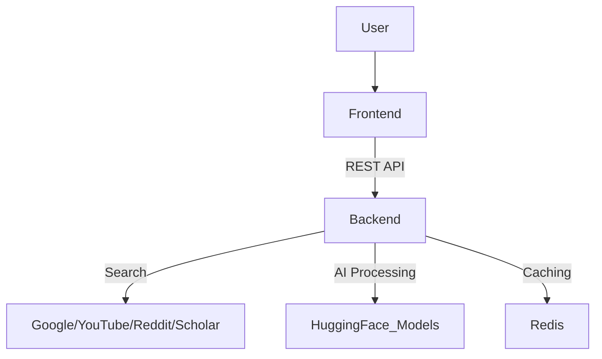

# 

# NeuraSeekNG 🚀  
**An AI-powered search engine integrating Google, YouTube, Reddit, and Google Scholar with real-time AI insights, sentiment analysis, and intelligent summaries.**


---

## 🔥 Features
- 🌍 **Multi-Platform Search** – Google, YouTube, Reddit, Google Scholar
- 🧠 **AI-Powered Summaries** – Smart summaries for retrieved results
- 💬 **Real-Time Sentiment Analysis** – Instant sentiment scoring
- ✅ **Source Credibility Verification** – Domain-based trust scoring
- 🎨 **Retro-Inspired UI** – Modern interactions with a vintage aesthetic
- 🌙 **Dark Mode Support** – Seamless experience in any lighting condition
- ⚡ **Performance Optimizations** – Caching, virtualized lists, lazy loading

---

## 🏗️ Architecture
### **Tech Stack**
- **Frontend**: React + Vite, Tailwind CSS, Framer Motion
- **Backend**: FastAPI (Python)
- **AI Services**: Hugging Face Models
- **Caching**: Custom Implementation
- **Deployment**: Vercel (Frontend), Railway + Gunicorn (Backend)

### **System Overview**


---

## 🚀 Getting Started
### **1️⃣ Clone the Repository**
```bash
git clone https://github.com/Nischaya008/NeuraSeekNG.git
cd NeuraSeekNG
```

### **2️⃣ Install Dependencies**
#### **Frontend**
```bash
cd frontend
npm install
```
#### **Backend**
```bash
cd backend
pip install -r requirements.txt
```

### **3️⃣ Run the Application**
#### **Start Backend**
```bash
uvicorn main:app --reload
```
#### **Start Frontend**
```bash
npm run dev
```

---

## 🤖 AI Integration
### **Models Used**
- **Summarizer**: `facebook/bart-large-cnn`
- **Sentiment Analysis**: `SamLowe/roberta-base-go_emotions`
- **Overall Sentiment**: `cardiffnlp/twitter-roberta-base-sentiment`

### **Implementation**
The backend processes search results through AI pipelines for enhanced insights and credibility scoring.

---

## ⚡ Performance Optimizations
- **Custom Caching System** – Reduces redundant requests
- **Virtualized Lists** – Smooth scrolling for large datasets
- **Lazy Loading** – Faster page loads and reduced bandwidth
- **Debounced Search** – Prevents excessive API calls

---

## 📦 Deployment
### **Backend** (Railway + Gunicorn)
```bash
gunicorn -w 4 -k uvicorn.workers.UvicornWorker main:app
```
### **Frontend** (Vercel)
Deploy with one command:
```bash
vercel --prod
```

---

## 🔒 Security Measures
- **CORS Configuration** – Prevents unauthorized access
- **API Key Management** – Secure storage and usage
- **Environment Variables** – Keeps credentials safe

---

## 📜 License
This project is licensed under the MIT License. See the [LICENSE](LICENSE) file for more details.

---

## 🌟 Contribute
We welcome contributions! If you'd like to enhance NeuraSeekNG, feel free to:
1. Fork the repo
2. Create a feature branch (`git checkout -b feature-name`)
3. Commit your changes (`git commit -m 'Add new feature'`)
4. Push to the branch (`git push origin feature-name`)
5. Open a PR

---

## 📬 Contact
For queries, feel free to reach out via GitHub issues or email at `your-email@example.com`.

---

## 🎯 Future Enhancements
- 🔎 Personalized Search Ranking using Reinforcement Learning
- 🗂️ Search History & User Preferences
- 📈 Advanced Data Analytics Dashboard

---

Give a ⭐ if you like this project! Happy searching! 🚀
